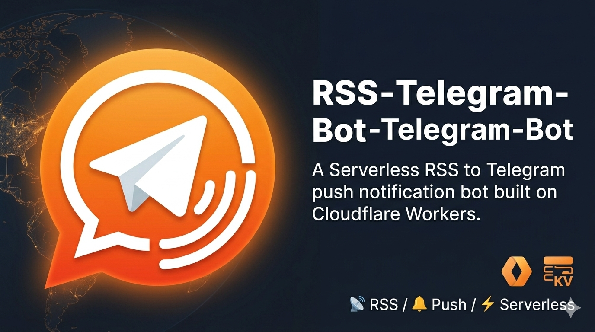

<div align="center">
  
  <h1>📡 RSS Telegram Bot</h1>
  <p>基于 Cloudflare Worker 的 Telegram RSS 订阅推送机器人，零服务器、零成本、零运维。</p>

  [](LICENSE)
  [](https://workers.cloudflare.com/)
</div>

<br/>
## ✨ 功能

- 📰 支持 RSS 2.0 / Atom 订阅源
- 🔔 每 5 分钟自动检查并推送新内容
- 🎛️ Inline 按钮交互，轻松管理订阅
- 🔐 Webhook Secret + 管理密码双重安全
- ⚡ 基于 Cloudflare Worker，完全 Serverless

## 🚀 部署

### 1. 前置准备

- [Cloudflare](https://dash.cloudflare.com/) 账号
- 通过 [@BotFather](https://t.me/BotFather) 创建的 Telegram Bot Token
- 安装 [Wrangler CLI](https://developers.cloudflare.com/workers/wrangler/install-and-update/)

### 2. 创建 KV 命名空间

```bash
wrangler kv namespace create "RSS_KV"
```

记下输出的 `id`，填入 `wrangler.toml`。

### 3. 配置 wrangler.toml

```toml
name = "rss-telegram-bot"
main = "worker.js"
compatibility_date = "2024-01-01"

[triggers]
crons = ["*/5 * * * *"]

[[kv_namespaces]]
binding = "RSS_KV"
id = "你的KV命名空间ID"
```

### 4. 设置 Secrets

```bash
wrangler secret put BOT_TOKEN        # Telegram Bot Token
wrangler secret put WEBHOOK_SECRET   # Webhook 密钥（自定义字符串）
wrangler secret put ADMIN_PASSWORD   # 管理端点密码
```

### 5. 部署

```bash
wrangler deploy
```

### 6. 注册 Webhook

```bash
curl "https://你的域名/setup?password=你的管理密码"
```

完成后即可在 Telegram 中使用 Bot。

## 📖 使用

1. 在 Telegram 搜索并打开你的 Bot
2. 发送 `/start` 进入主菜单
3. 点击 **订阅管理** → **添加订阅**
4. 发送 RSS 链接即可完成订阅
5. 新内容会自动推送到聊天

## 🔧 管理端点

| 端点 | 说明 |
|------|------|
| `/setup?password=xxx` | 注册 Webhook 和 Bot 命令 |
| `/remove?password=xxx` | 移除 Webhook |
| `/cron?password=xxx` | 手动触发一次 RSS 检查 |

## 📝 环境变量

| 变量名 | 说明 |
|--------|------|
| `BOT_TOKEN` | Telegram Bot API Token |
| `WEBHOOK_SECRET` | Webhook 路径密钥 |
| `ADMIN_PASSWORD` | 管理端点访问密码 |
| `RSS_KV` | KV 命名空间绑定 |

## 📄 License

[MIT](LICENSE)
